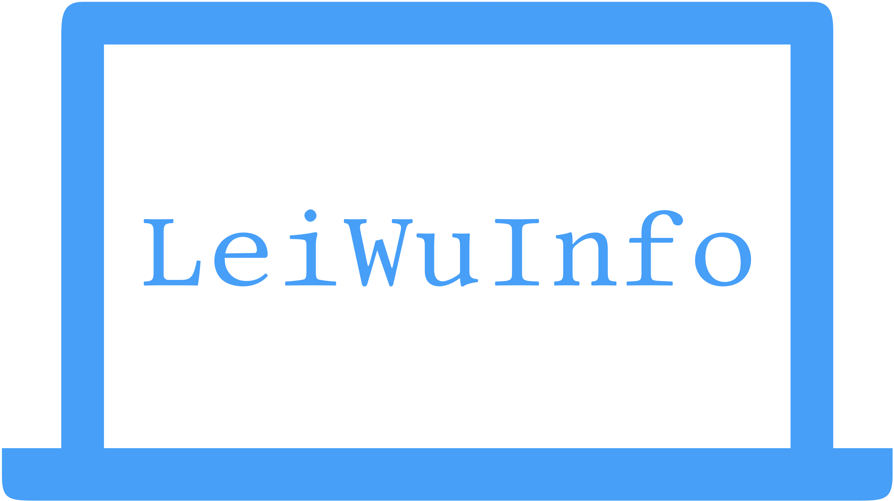
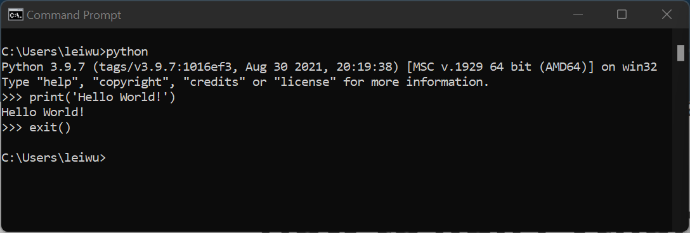
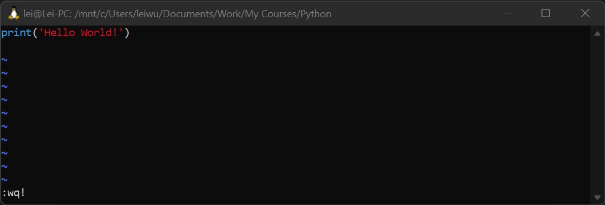
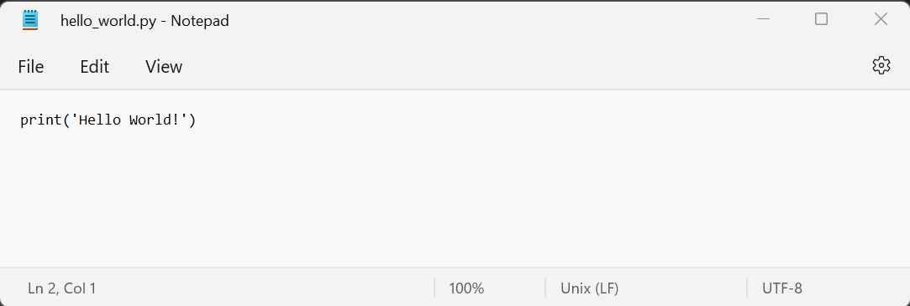
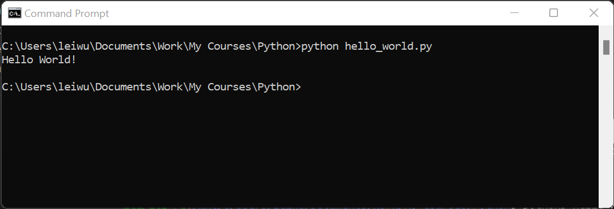
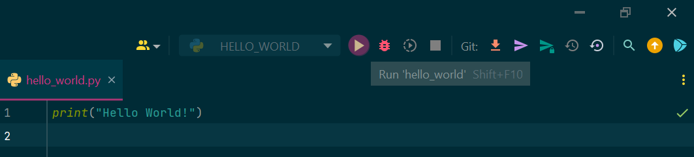

# Python for Beginner <!-- fit -->
## Python Course
Lei Wu



---
<!-- footer: '' -->
# 

It is a high-level, interpreted, general-purpose programming language.

Easy to pick up whether you're a first-time programmer or experienced with other languages.

---
# General Purposes

* Scientific Computation
* Process Automation
* Visualization
* App Development

---
# Scientific Computation

* Linear Algebra
* Power System Analysis
* Signal Processing
* Control Theory
* Graph Theory
* Finance
* Artificial Intelligence / Machine Learning
* ...

---
# Process Automation

* API's of various third-party software and web server
    * PowerFactory, PSCAD, ...
    * Twitter, Yahoo Finance, ...
* Document generation / manipulation
    * csv, json, xml, ...
    * tex, md, adoc, ...
    * docx, xlsx, pptx, ...

---
# Visualization

* Various plots (2D/3D)
    * line, bar, pie, scatter, candlestick, geograph, ...
* Image processing

---
# App Development

Desktop App and Web App

* Front end
* Back end
* Database

---
# Python Skill's Levels
### Beginner

* Be comfortable to use Python
* Know common packages/libraries
* Can realize certain (simple) tasks with Python

---
# Python Skill's Levels
### Advanced

* Can design clean and pragmatic code architecture with the concept of **Separation of Concern**.
* Can write clean code that is readable and maintainable.
* Can write tests for your code.
* Can use dedicated virtual environment for each Python project.
* ...

---
# Resources

* [Official website](https://www.python.org/)
* [Google](https://www.google.com/)
* [Stack Overflow](https://stackoverflow.com/)
* LeiWuInfo :wink:

---
# Installation

* Visit the [official website](https://www.python.org/)
* Decide the version
    * Python 2 sunset date: 2020-01-01. Not recommended any more.
    * Python 3. Normally choose the latest version (Python 3.10.5 on 2022-07-02)
* Follow instrucitons for Windows, macOS, Linux

---
# Use

* Write code in an interactive session from a terminal.
* Write a Python module (`py`-file). And run it with:
    * Command line in a terminal
    * IDE
        * [PyCharm](https://www.jetbrains.com/pycharm/)
        * [Visual Studio Code](https://code.visualstudio.com/)

---
# Interactive Session
1. In a terminal, type `python` or `python3`, depending on the settings on your computer. And start coding
2. Type `exit()` to exit the interactive session.


---
# Write Python Modules
### In Terminal
Text editor in terminal, like [vim](https://www.vim.org/).


---
# Write Python Module
### Plain Text Editor
* Plain text editor, like Windows Notepad.


---
# Write Python Module
### IDE

IDE - *Integrated Development Environment*
* Syntax high-lighting
* Code formatting and analysis
* Run and debug

---
# Run Python Module
### Command Line
1. Write the hello-world file and use the file name `hello_world.py`.
2. In a terminal, navigate to the directory where this file is stored, type the command `python <filename.py>`. `<...>` is a placeholder.


---
# Run Python Module
### IDE
Click the `Run` button on an IDE.



---
# Values of Built-in Basic Types

* Type: `NoneType`. Only one value: `None`.
* Type: `bool`. Only two values: `True` and `False`. 
* Type: `int`. Examples: `-1`, `0`, `1`, `2`, `3`, ...
* Type: `float`. Examples: `-1.1`, `0.5`, `1.0`, `23.456`, ...
* Type: `complex`. Examples: `1 + 2j`, `-1.5 + 123.45j`, ...
* Type: `str`. Examples: `'Hello World'`, `"name"`, `'Monday'`, ...
...

*Demo*: show them in an interactive session on a terminal.

---
# String

Enclosed by a pair of quotation marks.
* `'This is a string'`
* `"This is a string, too"`
* ```
    """
    This is a string over multiple lines.
    Line 1.
    Line 2.
    """
  ```

---
# Tuple

* The built-in type is `tuple`. Enclosed by `(` `)`. Elements are separated by comma `,`.
* Examples:
    * `(1, 2, 3)`
    * `('a', 'b')`
    * `(True, 100, -1.5, 1+2j, 'name', None, [1, 2])`
    * Nested tuple: `(('apple', 'orange'), (1, 2, 3), 4, 5)`
---
# List

* The built-in type is `list`. Enclosed by `[` `]`. Elements are separated by comma `,`.
* Examples: 
    * `[1, 2, 3]`
    * `['a', 'b']`
    * `[True, 100, -1.5, 1+2j, 'name', None, (1, 2)]`
    * Nested list: `[['apple', 'orange'], [1, 2, 3], 4, 5]`


---
# Dict

* The built-in type is `dict`. Enclosed by `{` `}`. Elements are pairs of key-values. Each pair is defined in the format of `key: value`. Pairs are separated by comma `,`.
* Examples:
    * `{'name': 'apple', 'color': 'red', 'price': 1.23}`
    * `{1:  'first', 2: '2nd', 3: 'third', 4: None}`
    * Nested dictionary: 
    `{'name': 'apple', 'prop': {'color': 'red', 'price': 1.23}}`

---
# Operators

* `+`, `-`, `*`, `/`, `**`, `%`
    * With numbers, e.g. : `1 + 1`, `3 - 1.5`, `2*3`, `4**0.5`, `30/7`, `30%7`
    * With strings, e.g.: `'Today' + ' ' + 'is ' + 'Tuesday.'`
    * With lists, e.g.: `[1]*3`, `['apple']*3`, `[None]*3`
* `>`, `<`, `==`, `>=`, `<=`
    * `5 > 3`, `-1 == 10`, `5 <= 3`, `'A' < 'B'`

---
# Assignment

Assign any type of data a name by the symbol `=`.

Examples:
* `a = 1`, `fruit = 'apple'`, `integers = [1, 2, 3]`, `credentials = {'user': 'Me', 'pass': '***'}`
* `total = 1 + 1`, `msg = 'Today is' + ' Tuesday.'`, `is_less = 3 < 4`

---
# Naming style:
* Alphanumeric (`A`-`Z`, `0`-`9`) and underscore `_`
* Recommendation: 
    * Short but informative.
    * For constants, all in upper case
        * E.g. `COLOR = '#00FF00'`, `MY_AGE = 18`.
    * For variables, all in lower case
        * E.g. `class_room_2` instead of `cr2` or `x`.

---
# Benefit of Assignment
Reuse in other expressions.
```python
a = 2
b = a * 3
c, d = 'Hello ', 'World.'
greeting = c + d 
```

---
# Comments

Anything after the symble `#` is treated as comments.

```python
a = 1 * 2  # Explain the code
# If you need to write more,
# You can use multiple lines.
```

---
# Access Elements in Tuple and List
Use the index enclosed by `[` `]`. The index starts from `0`.
```python
fruits_tuple = ('apple', 'orange', ('banana', 'berry'))

print(fruits_tuple[0])
print(fruits_tuple[2][0])

fruits_list = ['apple', 'orange', ['banana', 'berry']]

print(fruits_list[1])
print(fruits_list[2][1])
```

---
# Access Elements in Dict
Use the key enclosed by `[` `]`. The key is defined in each kay-value pair. 
```python
fruits = {'name': 'apple', 'prop': {'color': 'red', 'price': 1.23}}

print(fruits['name'])
print(fruits['prop']['color'])
```

---
# Block and Indentation
Its design philosophy emphasizes code readability with the use of significant indentation. Syntax
```python
expression:
    line_1
    line_2
```
* The first line is not indented, ended by a colon `:`
* The following lines in the block must be indented with the same number of spaces. A common practice is four spaces.

---
# Loops
Loops let the program iteratively run a block of code.

* `while`-loop
* `for`-loop

---
# While Loop
```python
while expression:
    block of statements
```
If the expression is `True`, then executes the block of statements.
Otherwise, the `while`-loop is finished. Example:
```python
count = 1
while count < 5:
    print(count)
    count += 1
```

---
# For Loop
```python
for elem in a_sequence:
    block of statements
```
If all the elements in the sequence is used, the `for`-loop is finished. Example:
```python
for count in [1, 2, 3, 4]:
    print(count)
```
---
# Function
<!-- _class: split -->

<div class=ldiv>

#### Syntax of definition
```python
def func_name(param_1, param_2):
    """
    Docstring explains the purpose, 
    inputs, and returns of this function.
    """
    return param_1 + param_2
```
</div>

<div class=rdiv>

#### Example of call
```python
# Use the function name followed by all the
#   arguments, enclosed by ().
# 1 is a positional argument
# param_2=2 is a keyword argument.   
# The returned is assigned to variable res.
res = func_name(1, param_2=2)
print(res)
```
</div>

---
# Class
<!-- _class: split -->

<div class=ldiv>

#### Syntax of definition
```python
class ClassName:
    def __init__(self, param_1, param_2):
        self.param_1 = param_1  # attribute
        self.param_2 = param_2  # attribute

    def run(self, param_3):  # method
        res = self.param_1 + self.param_2 - param_3
        return res
```
</div>

<div class=rdiv>

#### Example of instance
```python
# Create an instance of the class
# Provide arguments to the __init__ method.
instance_1 = ClassName(1, param_2=2)

# Call a method
#  use the dot sign "." followed by the method name
res = instance_1.run(param_3=3)
print(res)
```
</div>

---
# Import
Import an object from other files in the same folder and other folder to the current file.

```python
import module_1
import module_2 as new_name
from module_3 import ClassName, func_name, CONSTANT_1
from package_4 import module_4
from pacakge_5.module_5 import func_name_5
```

---
# Examples of Import

```python
import sys
import multiprocessing as mp
from datetime import date

print(sys.platform)
print(mp.cpu_count())
print(date.today())
```

---
# Lei Wu
### Experience

* 12+ years of experience in the combined fields of 
    * electrical engineering (achieved Ph.D. degree),
    * data analytics (worked as a senior data scientist)
    * software development (worked as a senior developer).
* Developed Python code style guidelines for several companies.
* Developed several commercial software in Python for scientific computation.

---
# Python Courses by LeiWuInfo

* In-depth explanation with hands-on projects.
* Discuss loads of realistic issues that I have experienced. 
* For both beginner level and advanced level.
* From one-day course to several days.
* Classroom training course at your location or online.
* Can be custom-made with any combination of topics mentioned in this presentation including:
    * scientific computation, process automation, visualization, app development

---
<!-- The symbol | is used to show nothing in the footer -->
<!-- _footer: | -->
# Contact

Lei Wu

Email: leiwuinfo@gmail.com
LinkedIn: www.linkedin.com/in/lei-wu-58794a73
GitHub: @leiwu84


