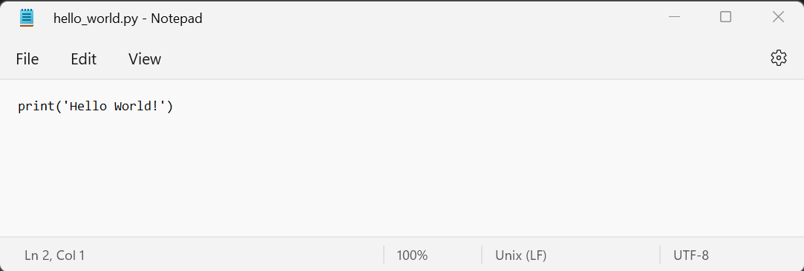

- Write code in an interactive session from a terminal.
- Write a Python module (`py`-file). And run it with:
    - Command line in a terminal
    - IDE
        - [PyCharm](https://www.jetbrains.com/pycharm/)
        - [Visual Studio Code](https://code.visualstudio.com/)
- Run

---
## Interactive Session
1. In a terminal, type `python` or `python3`, depending on the settings on your computer. And start coding
2. Type `exit()` to exit the interactive session.

---
## Write Python Module
### In Terminal
Text editor in terminal, like [vim](https://www.vim.org/).

### Plain Text Editor
* Plain text editor, like Windows Notepad.

### IDE

IDE - *Integrated Development Environment*
* Syntax high-lighting
* Code formatting and analysis
* Run and debug

---
## Run
### Command Line
1. Write the hello-world file and use the file name `hello_world.py`.
2. In a terminal, navigate to the directory where this file is stored, type the command `python <filename.py>`. `<...>` is a placeholder.

### IDE
Click the `Run` button on an IDE.

